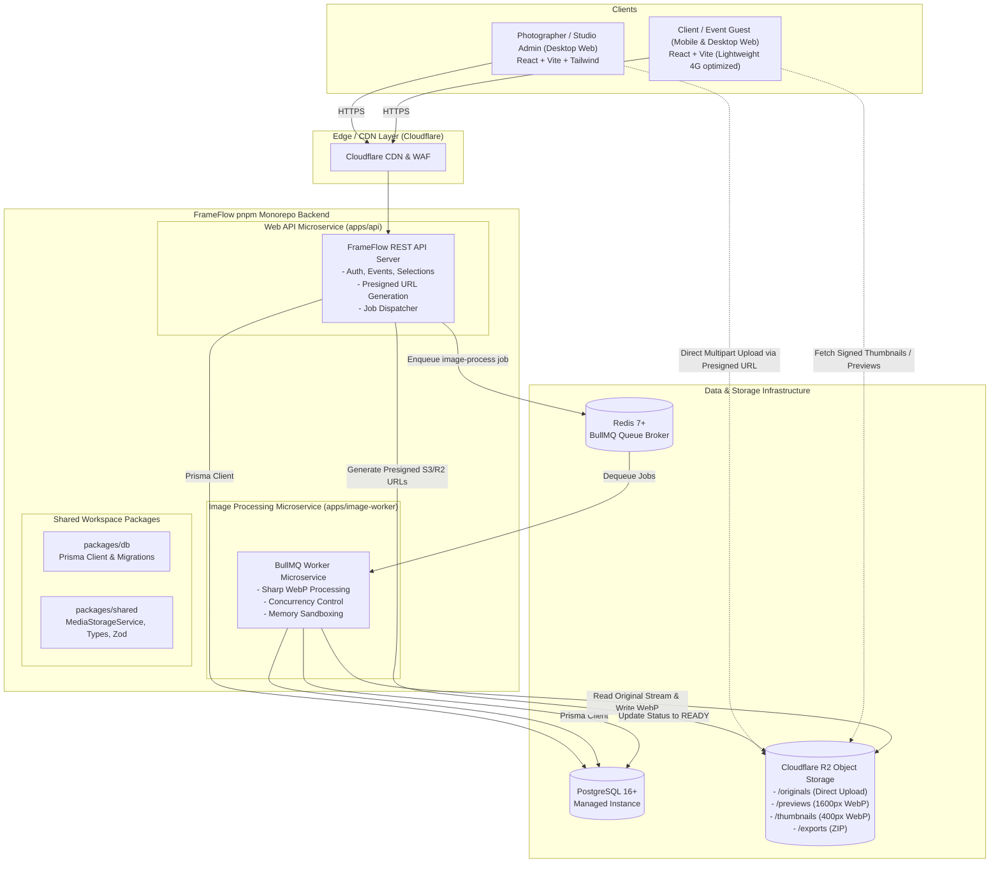
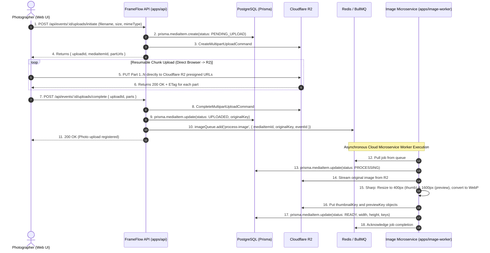

# FrameFlow — Technical Architecture & PostgreSQL Database Schema Specification

> **Document Version:** 1.1 (Updated with Prisma ORM & Image Worker Microservice)  
> **Status:** Approved Architecture Draft  
> **Target Milestone:** M1 (Project Setup, Architecture & Database Schema)  
> **Based on:** [Statement of Work (SOW v0.1)](file:///e:/Projects/FrameFlow/docs/SOW.md)

---

## 1. System Architecture Overview

FrameFlow is an event photo selection and proofing SaaS tailored for Indian photographers (weddings, pre-weddings, corporate, and school events). The system is engineered around three core principles:
1. **Zero-Egress Direct-to-Storage Uploads:** High-resolution photos are uploaded directly from the browser to Cloudflare R2 (S3-compatible) using presigned multipart URLs, ensuring that gigabytes of RAW/JPEG uploads never saturate API server memory or network bandwidth.
2. **Dedicated Image Processing Microservice:** Compute-intensive Sharp resizing (400px WebP thumbnails and 1600px WebP previews) is completely decoupled into an independent worker microservice (`apps/image-worker`) connected via Redis/BullMQ. It scales independently from 1 to N instances without affecting web API latency.
3. **Stateless, Secure Client Proofing:** Event clients authenticate with an event URL and a 4- to 6-digit PIN. Raw PINs are never stored; access is verified against an Argon2id/bcrypt hash with sliding-window rate limiting, issuing a short-lived signed JWT session cookie.

### 1.1 Architecture Diagram



---

## 2. Monorepo Structure (pnpm Workspaces)

The codebase is organized as a clean, modular pnpm monorepo:

```
FrameFlow/
├── apps/
│   ├── web/                     # React 19 + TypeScript + Vite + Tailwind CSS
│   │   ├── src/
│   │   │   ├── components/      # UI components (Grid, Lightbox, PIN modal, Upload zone)
│   │   │   ├── pages/           # Agency dashboard & Client gallery routes
│   │   │   ├── hooks/           # Resumable upload hook, session hook
│   │   │   └── api/             # Typed API client
│   │   └── package.json
│   │
│   ├── api/                     # Node.js + Express + TypeScript REST API
│   │   ├── src/
│   │   │   ├── routes/          # /auth, /events, /uploads, /galleries, /exports
│   │   │   ├── controllers/     # Request handlers
│   │   │   ├── services/        # EventService, PinService, PresignedUrlService
│   │   │   ├── queues/          # BullMQ queue producers
│   │   │   └── middlewares/     # Auth, RateLimiter, ErrorHandler
│   │   └── package.json
│   │
│   └── image-worker/            # Dedicated Image Processing Microservice
│       ├── src/
│       │   ├── workers/         # BullMQ queue consumer (concurrency tuned)
│       │   ├── processors/      # Sharp transformer (400px thumb, 1600px preview)
│       │   └── health/          # Healthcheck & metrics endpoint
│       └── package.json
│
├── packages/
│   ├── db/                      # Database Layer (Prisma)
│   │   ├── prisma/
│   │   │   └── schema.prisma    # PostgreSQL Schema definition
│   │   ├── src/
│   │   │   └── client.ts        # Singleton Prisma client export
│   │   └── package.json
│   │
│   └── shared/                  # Shared Business Logic & Types
│       ├── src/
│       │   ├── storage/         # MediaStorageService interface & R2 implementation
│       │   ├── types/           # API DTOs, Event/Media enums, Session tokens
│       │   └── schemas/         # Zod validation schemas
│       └── package.json
│
├── docs/
│   ├── SOW.md                   # Statement of Work
│   └── ARCHITECTURE_AND_SCHEMA.md
├── pnpm-workspace.yaml
├── package.json
└── tsconfig.base.json
```

---

## 3. Direct-to-Storage Upload & Image Processing Microservice

### 3.1 Why a Dedicated Microservice for Image Processing?

1. **CPU & Memory Isolation:** Sharp utilizes native C++ `libvips`. Generating WebP files for a 2,000-photo batch spikes multi-core CPU and memory. Running Sharp inside the web API container would degrade API response times, drop user connections, or trigger out-of-memory (OOM) crashes.
2. **Independent Horizontal Scaling:** The `apps/api` microservice is I/O-bound (low CPU, low RAM) and can run on minimal instances. The `apps/image-worker` microservice is compute-bound and can scale dynamically (e.g. from 1 worker pod to 8 worker pods during peak weekend wedding uploads) based on BullMQ queue depth.
3. **Resilience & Fault Isolation:** If a photographer uploads an unusual or corrupt RAW/JPEG file that crashes `libvips`, the worker process catches or isolates the crash, retries with backoff, flags that single `MediaItem` as `FAILED`, and the API server remains completely unaffected.

### 3.2 Sequence Flow: Direct Upload to Microservice Processing



---

## 4. PostgreSQL Database Schema Specification (Prisma)

Below is the complete, production-ready `schema.prisma` covering all MVP entities, relations, enums, and performance indexes.

```prisma
// packages/db/prisma/schema.prisma

datasource db {
  provider = "postgresql"
  url      = env("DATABASE_URL")
}

generator client {
  provider = "prisma-client-js"
}

// ============================================================================
// ENUMS
// ============================================================================

enum UserRole {
  STUDIO_OWNER
  STUDIO_MEMBER
  ADMIN
}

enum EventStatus {
  DRAFT
  ACTIVE
  SELECTION_SUBMITTED
  ARCHIVED
  EXPIRED
  PURGED
}

enum MediaStatus {
  PENDING_UPLOAD
  UPLOADED
  PROCESSING
  READY
  FAILED
}

enum RoundStatus {
  OPEN
  SUBMITTED
  APPROVED
  LOCKED
}

enum ExportType {
  ZIP_ORIGINALS
  CSV_FILENAMES
  LIGHTROOM_TEXT
}

enum ExportStatus {
  PENDING
  PROCESSING
  COMPLETED
  FAILED
}

enum ActorType {
  AGENCY_USER
  EVENT_CLIENT
  SYSTEM_WORKER
}

// ============================================================================
// 1. USERS MODEL (Photographers & Studio Owners)
// ============================================================================

model User {
  id                String      @id @default(uuid()) @db.Uuid
  email             String      @unique @db.VarChar(255)
  passwordHash      String      @map("password_hash") @db.VarChar(255)
  fullName          String      @map("full_name") @db.VarChar(150)
  studioName        String      @map("studio_name") @db.VarChar(200)
  phone             String?     @db.VarChar(20)
  role              UserRole    @default(STUDIO_OWNER)
  isActive          Boolean     @default(true) @map("is_active")
  storageUsedBytes  BigInt      @default(0) @map("storage_used_bytes")
  createdAt         DateTime    @default(now()) @map("created_at") @db.Timestamptz()
  updatedAt         DateTime    @updatedAt @map("updated_at") @db.Timestamptz()

  events            Event[]
  auditLogs         AuditLog[]

  @@map("users")
}

// ============================================================================
// 2. EVENTS MODEL (Photo Selection Projects)
// ============================================================================

model Event {
  id                  String        @id @default(uuid()) @db.Uuid
  userId              String        @map("user_id") @db.Uuid
  title               String        @db.VarChar(255)
  slug                String        @unique @db.VarChar(100)
  eventType           String        @map("event_type") @db.VarChar(100)
  eventDate           DateTime      @map("event_date") @db.Date
  clientName          String        @map("client_name") @db.VarChar(150)
  clientEmail         String        @map("client_email") @db.VarChar(255)
  clientPhone         String?       @map("client_phone") @db.VarChar(20)

  // PIN Security: Stored as Argon2id/bcrypt hash + random salt
  pinHash             String        @map("pin_hash") @db.VarChar(255)
  pinSalt             String        @map("pin_salt") @db.VarChar(64)

  coverMediaId        String?       @map("cover_media_id") @db.Uuid
  status              EventStatus   @default(DRAFT)

  photoCount          Int           @default(0) @map("photo_count")
  totalBytes          BigInt        @default(0) @map("total_bytes")

  // Expiry & Retention Lifecycle
  expiresAt           DateTime      @map("expires_at") @db.Timestamptz()
  gracePeriodEndsAt   DateTime      @map("grace_period_ends_at") @db.Timestamptz()
  purgedAt            DateTime?     @map("purged_at") @db.Timestamptz()

  createdAt           DateTime      @default(now()) @map("created_at") @db.Timestamptz()
  updatedAt           DateTime      @updatedAt @map("updated_at") @db.Timestamptz()

  user                User          @relation(fields: [userId], references: [id], onDelete: Restrict)
  coverMedia          MediaItem?    @relation("EventCover", fields: [coverMediaId], references: [id], onDelete: SetNull)

  mediaItems          MediaItem[]   @relation("EventMedia")
  selectionRounds     SelectionRound[]
  clientSessions      ClientSession[]
  pinAttempts         PinAttempt[]
  exportJobs          ExportJob[]
  auditLogs           AuditLog[]

  @@index([userId])
  @@index([slug])
  @@index([status, expiresAt])
  @@index([clientEmail])
  @@map("events")
}

// ============================================================================
// 3. MEDIA_ITEMS MODEL (Photos within an Event)
// ============================================================================

model MediaItem {
  id                String       @id @default(uuid()) @db.Uuid
  eventId           String       @map("event_id") @db.Uuid
  originalFilename  String       @map("original_filename") @db.VarChar(255)

  // Object Storage Keys (R2 / S3)
  originalKey       String       @map("original_key") @db.VarChar(500)
  previewKey        String?      @map("preview_key") @db.VarChar(500)   // 1600px WebP preview
  thumbnailKey      String?      @map("thumbnail_key") @db.VarChar(500) // 400px WebP thumbnail

  mimeType          String       @map("mime_type") @db.VarChar(100)
  fileSizeBytes     BigInt       @map("file_size_bytes")
  width             Int?
  height            Int?

  status            MediaStatus  @default(PENDING_UPLOAD)
  checksumSha256    String?      @map("checksum_sha256") @db.VarChar(64)
  sortOrder         Int          @default(0) @map("sort_order")

  createdAt         DateTime     @default(now()) @map("created_at") @db.Timestamptz()
  updatedAt         DateTime     @updatedAt @map("updated_at") @db.Timestamptz()

  event             Event        @relation("EventMedia", fields: [eventId], references: [id], onDelete: Cascade)
  coveredEvents     Event[]      @relation("EventCover")
  selections        Selection[]

  @@index([eventId])
  @@index([eventId, status])
  @@index([eventId, sortOrder(sort: Asc)])
  @@map("media_items")
}

// ============================================================================
// 4. SELECTION_ROUNDS MODEL (Round 1 for MVP, Multi-round ready)
// ============================================================================

model SelectionRound {
  id             String        @id @default(uuid()) @db.Uuid
  eventId        String        @map("event_id") @db.Uuid
  roundNumber    Int           @default(1) @map("round_number")
  status         RoundStatus   @default(OPEN)
  maxSelections  Int?          @map("max_selections")
  clientNotes    String?       @map("client_notes") @db.Text
  submittedAt    DateTime?     @map("submitted_at") @db.Timestamptz()
  createdAt      DateTime      @default(now()) @map("created_at") @db.Timestamptz()
  updatedAt      DateTime      @updatedAt @map("updated_at") @db.Timestamptz()

  event          Event         @relation(fields: [eventId], references: [id], onDelete: Cascade)
  selections     Selection[]
  exportJobs     ExportJob[]

  @@unique([eventId, roundNumber])
  @@index([eventId, status])
  @@map("selection_rounds")
}

// ============================================================================
// 5. SELECTIONS MODEL (Chosen Photos)
// ============================================================================

model Selection {
  id             String         @id @default(uuid()) @db.Uuid
  roundId        String         @map("round_id") @db.Uuid
  mediaItemId    String         @map("media_item_id") @db.Uuid
  clientComment  String?        @map("client_comment") @db.Text
  selectedAt     DateTime       @default(now()) @map("selected_at") @db.Timestamptz()

  round          SelectionRound @relation(fields: [roundId], references: [id], onDelete: Cascade)
  mediaItem      MediaItem      @relation(fields: [mediaItemId], references: [id], onDelete: Cascade)

  @@unique([roundId, mediaItemId])
  @@index([roundId])
  @@index([mediaItemId])
  @@map("selections")
}

// ============================================================================
// 6. CLIENT_SESSIONS MODEL (Temporary PIN Sessions)
// ============================================================================

model ClientSession {
  id                String       @id @default(uuid()) @db.Uuid
  eventId           String       @map("event_id") @db.Uuid
  sessionTokenHash  String       @unique @map("session_token_hash") @db.VarChar(255)
  ipAddress         String?      @map("ip_address") @db.VarChar(45)
  userAgent         String?      @map("user_agent") @db.Text
  expiresAt         DateTime     @map("expires_at") @db.Timestamptz()
  createdAt         DateTime     @default(now()) @map("created_at") @db.Timestamptz()

  event             Event        @relation(fields: [eventId], references: [id], onDelete: Cascade)

  @@index([sessionTokenHash])
  @@index([expiresAt])
  @@map("client_sessions")
}

// ============================================================================
// 7. PIN_ATTEMPTS MODEL (Brute-Force Lockout Defense)
// ============================================================================

model PinAttempt {
  id              String       @id @default(uuid()) @db.Uuid
  eventId         String       @map("event_id") @db.Uuid
  ipAddress       String       @map("ip_address") @db.VarChar(45)
  failedAttempts  Int          @default(1) @map("failed_attempts")
  lockedUntil     DateTime?    @map("locked_until") @db.Timestamptz()
  lastAttemptAt   DateTime     @default(now()) @map("last_attempt_at") @db.Timestamptz()

  event           Event        @relation(fields: [eventId], references: [id], onDelete: Cascade)

  @@unique([eventId, ipAddress])
  @@index([eventId, ipAddress])
  @@map("pin_attempts")
}

// ============================================================================
// 8. EXPORT_JOBS MODEL (ZIP & CSV Exports)
// ============================================================================

model ExportJob {
  id             String         @id @default(uuid()) @db.Uuid
  eventId        String         @map("event_id") @db.Uuid
  roundId        String         @map("round_id") @db.Uuid
  exportType     ExportType     @map("export_type")
  status         ExportStatus   @default(PENDING)
  outputKey      String?        @map("output_key") @db.VarChar(500)
  fileSizeBytes  BigInt?        @map("file_size_bytes")
  errorMessage   String?        @map("error_message") @db.Text
  expiresAt      DateTime?      @map("expires_at") @db.Timestamptz()
  createdAt      DateTime       @default(now()) @map("created_at") @db.Timestamptz()
  completedAt    DateTime?      @map("completed_at") @db.Timestamptz()

  event          Event          @relation(fields: [eventId], references: [id], onDelete: Cascade)
  round          SelectionRound @relation(fields: [roundId], references: [id], onDelete: Cascade)

  @@index([eventId, status])
  @@map("export_jobs")
}

// ============================================================================
// 9. AUDIT_LOGS MODEL (Security, Retention & DPDP Compliance)
// ============================================================================

model AuditLog {
  id         String     @id @default(uuid()) @db.Uuid
  eventId    String?    @map("event_id") @db.Uuid
  userId     String?    @map("user_id") @db.Uuid
  actorType  ActorType  @map("actor_type")
  action     String     @db.VarChar(100)
  ipAddress  String?    @map("ip_address") @db.VarChar(45)
  metadata   Json       @default("{}")
  createdAt  DateTime   @default(now()) @map("created_at") @db.Timestamptz()

  event      Event?     @relation(fields: [eventId], references: [id], onDelete: SetNull)
  user       User?      @relation(fields: [userId], references: [id], onDelete: SetNull)

  @@index([eventId])
  @@index([action])
  @@index([createdAt])
  @@map("audit_logs")
}
```

---

## 5. Security & DPDP Compliance

- **Argon2id Hashing:** Both agency passwords and client PINs are cryptographically salted and hashed.
- **Short-Lived Signed URLs:** Thumbnail, preview, and original download URLs are signed with expiration times (15 minutes for previews, 24 hours for ZIP exports).
- **DPDP Act Ready:**
  - Automated deletion worker triggers once `grace_period_ends_at` is reached.
  - Hard purge deletes all objects from Cloudflare R2 and removes personal data from PostgreSQL.
  - Complete immutable audit trails recorded in `audit_logs`.
